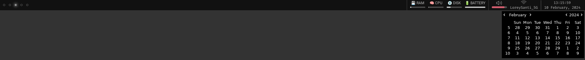

# EWW zen bar

[eww](https://elkowar.github.io/eww/eww.html) is a way to create desktop bars based on widgets.
It uses a language I am unfamiliar with, which is this `.yuck` extension. Despite that it is easy to configure and gives you a lot of freedom.

There is plenty of nicest bar around the internet, I really like this:

- https://github.com/adi1090x/widgets.git
- https://github.com/saimoomedits/eww-widgets.git

This bar is really simply, and lacks of interactivity, just pretty basic actions can be performed:

- Manipulate and toggle sound
- Activate / deactivate wifi
- Show calendar

## Current aspect

